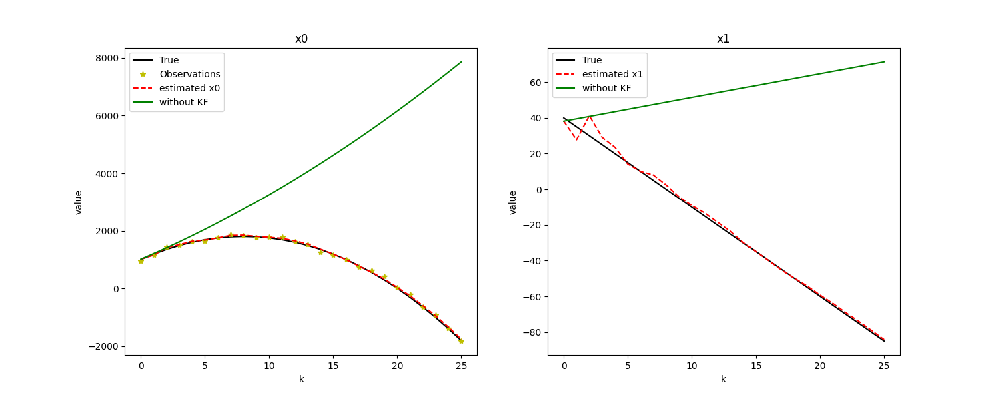
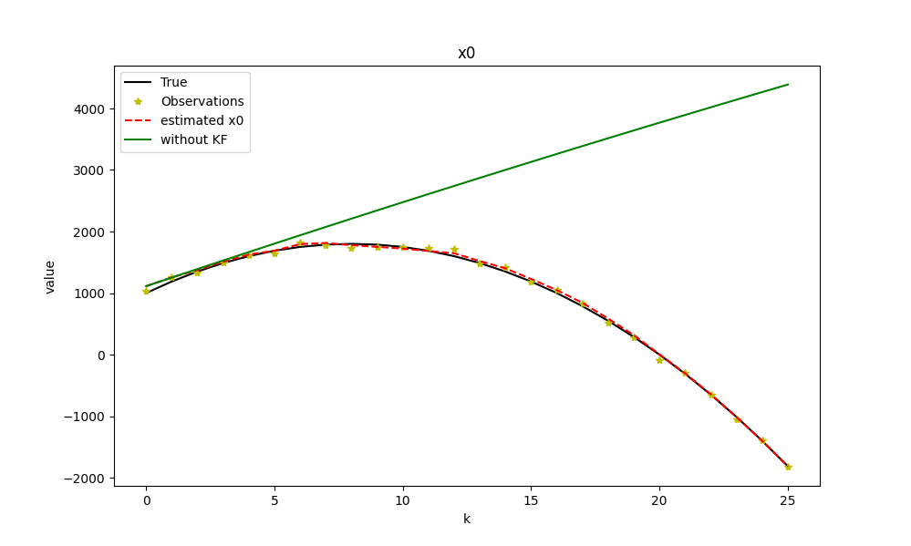
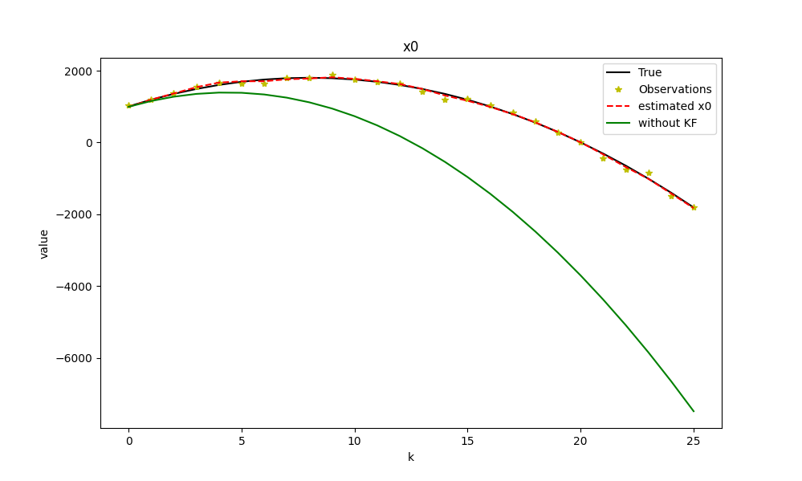
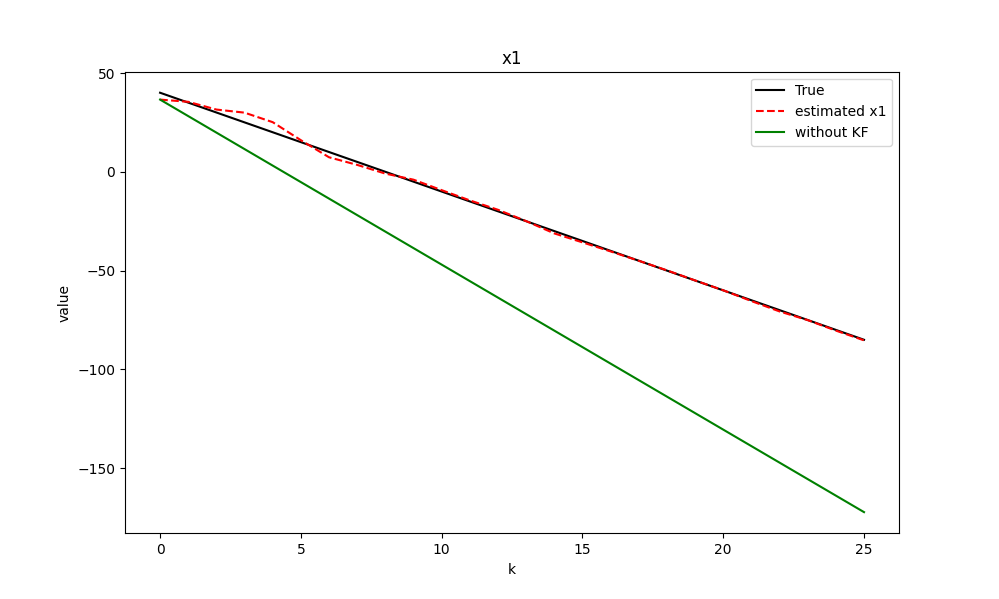
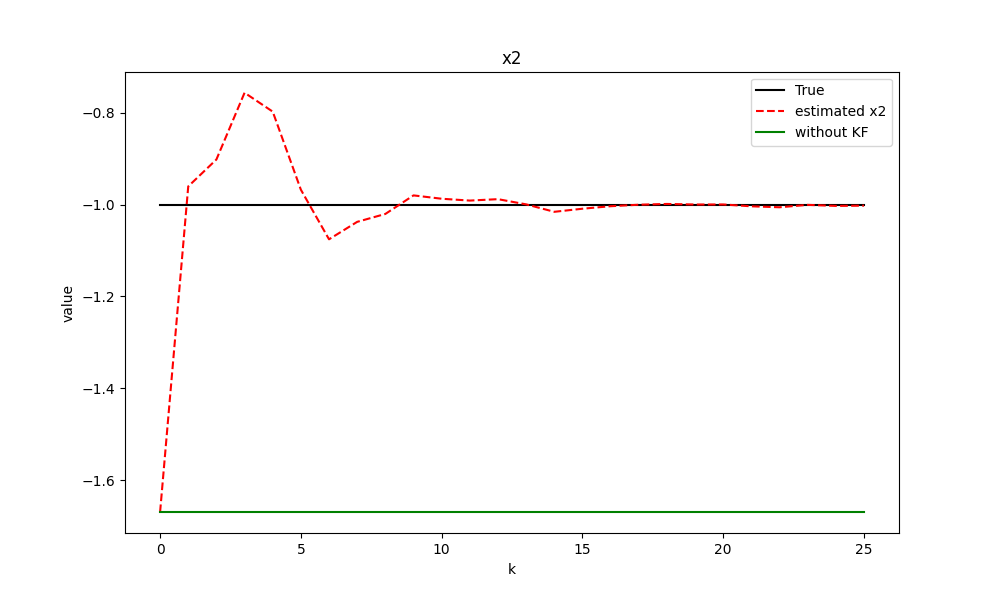

# KalmanFilterPlot
<details>
    <summary>Kalman Filter Code</summary>

```KF_Plot.py```
```python
import numpy as np
import matplotlib.pyplot as plt

class KF:
    def __init__(self, dim_x:int, dim_y:int, X0, P, M, Q, R, H):
        """
        @param:
        
        dim_x (int): dimension of X (m)
        
        dim_y (int): dimension of Observation Y (j)
        
        X0 (numpy.ndarray): Initial X (mean) mx1 
        
        P (numpy.ndarray): P (Covariance) mxm
        
        M (numpy.ndarray): M (Model Matrix) mxm 
        
        Q (numpy.ndarray): Q (Covariance of the model error) mxm
        
        R (numpy.ndarray): R (Covariance of the observation error) jxj
        
        H (numpy.ndarray): H (Observation Matrix) jxm
        """
        self.dim_x = dim_x  # dimension of X (m)
        self.dim_y = dim_y  # dimension of Observation Y (j)
        self.X = X0         # Initial X (mean) mx1 
        self.P = P          # P (Covariance) mxm
        self.M = M          # M (Model Matrix) mxm 
        self.Q = Q          # Q (Covariance of the model error) mxm
        self.R = R          # R (Covariance of the observation error) jxj
        self.H = H          # H (Observation Matrix) jxm
        
        # dimension check
        if ((dim_x,1) != X0.shape):
            raise ValueError("Wrong dimension (X0)")
        if ((dim_x,dim_x) != P.shape):
             raise ValueError("Wrong dimension (P)")
        if ((dim_x,dim_x) != M.shape):
            raise ValueError("Wrong dimension (M)")
        if ((dim_x,dim_x) != Q.shape):
            raise ValueError("Wrong dimension (Q)")
        if ((dim_y,dim_y) != R.shape):
            raise ValueError("Wrong dimension (R)")
        if ((dim_y,dim_x) != H.shape):
            raise ValueError("Wrong dimension (H)")

        self.Xm = X0        # without KF (process X only with M)
        
        self.X_cStack = X0  # collection of X (mxk, k = # of iterations)
        self.Xm_cStack = X0 # collection of Xm (mxk)
        
    def forecast(self):
        """
        Forecast X and P
        Also save Xm to compare with the estimate
        """
        self.X = self.M @ self.X 
        self.P = self.M @ self.P @ self.M.T + self.Q

        self.Xm = self.M @ self.Xm
        
        self.Xm_cStack = np.column_stack((self.Xm_cStack, self.Xm))
    
    def analyze(self, Y):
        """
        Analyze X and P
         
        Y (numpy.ndarray): Observation of the true state with observation error
        Y = H X_t + mu   where (mu ~ N(0,R))
        """
        if (self.dim_y != Y.shape[0]):
            raise ValueError("Wrong dimension (Y)")
        K = self.P @ self.H.T @ np.linalg.inv(self.H @ self.P @ self.H.T + self.R) # Kalman Gain Matrix
        self.X = K @ (Y - self.H @ self.X) + self.X
        self.P = (np.eye(self.dim_x) - K @ self.H) @ self.P
        
        self.X_cStack = np.column_stack((self.X_cStack, self.X))
    
    def get_xk(self, m):
        """
        return row m of X_cStack as a list 
        """
        return list(self.X_cStack[m,:])
    
    def plot_all(self, x_true=np.array([[]]), has_obs=[], Ys=np.array([[]]), titles=[]):
        """
        Plot each element (x_i) from X in 2D graph (value vs k)
        
        @param:
        
        x_true (numpy.ndarray, optional): Column stacked true states. Defaults to np.array([[]]).
        
        has_obs (int list, optional): One integer element 'i' represents x_i from X has observations. Defaults to [].
        
        Ys (numpy.ndarray, optional): ColumnStacked observations. Defaults to np.array([[]]).
        
        titles (string list, optional): Titles of the plots. Must have dim_x titles. Defaults to [].
        """
        xAxis = np.arange(self.Xm_cStack.shape[1])
        for i in range(self.X.shape[0]):
            plt.figure(figsize=(10,6))
            if (x_true.shape[1] == len(xAxis)):
                plt.plot(xAxis, x_true[i,:][xAxis], 'k', label="True")
            if (i in has_obs):
                plt.plot(xAxis, Ys[has_obs.index(i),:], 'y*', label="Observations")
            plt.plot(xAxis, self.get_xk(i), 'r--', label = f"estimated x{i}")
            plt.plot(xAxis, self.Xm_cStack[i,:][xAxis], 'g', label = "without KF")
            plt.title(f"x{i}")
            plt.xlabel("k")
            plt.ylabel("value")
            plt.legend(loc='best')
        plt.show()
    
    def plot_one(self, m:int, x_true=np.array([[]]), ym=None, Ys=np.array([[]]), title=None):
        """
        Plot one element (x_m) from X in 2D graph (value vs k)
        
        @param:
    
        x_true (numpy.ndarray, optional): Column stacked true states. Defaults to np.array([[]]).
        
        ym (int, optional): i-th row elements in Ys is corresponding Observation of x_m. Defaults to None.
        
        Ys (numpy.ndarray, optional): ColumnStacked observations. Defaults to np.array([[]]).
        
        title (string, optional): Title of the plot. Defaults to None
        """
        xAxis = np.arange(self.Xm_cStack.shape[1])
        plt.figure(figsize=(10,6))
        if (x_true.shape[1] == len(xAxis)):
            plt.plot(xAxis, x_true[m,:][xAxis], 'k', label="True")
        if (Ys.shape[1] == len(xAxis) and ym != None):
            plt.plot(xAxis, Ys[m,:][xAxis], 'y*', label="Observations")
        plt.plot(xAxis, self.get_xk(m), 'r--', label = f"estimated x{m}")
        plt.plot(xAxis, self.Xm_cStack[m,:][xAxis], 'g', label = "without KF")
        plotTitle1 = f"x{m}" if title is None else title
        plt.title(plotTitle1)
        plt.xlabel("k")
        plt.ylabel("value")
        plt.legend(loc='best')
        plt.show()
    
    def plot_two(self, m1:int, m2:int, x_true=np.array([[]]), ym1=None, ym2=None, Ys=np.array([[]]), title1=None, title2=None):
        """
        Plot two element (x_m1 and x_m2) from X in 2D graph (value vs k)
        
        @param:
        
        x_true (numpy.ndarray, optional): Column stacked true states. Defaults to np.array([[]]).
        
        ym1 (int, optional): ym1-th row elements in Ys is corresponding Observation of x_m1. Defaults to None.
        
        ym2 (int, optional): ym2-th row elements in Ys is corresponding Observation of x_m2. Defaults to None.
        
        Ys (numpy.ndarray, optional): ColumnStacked observations. Defaults to np.array([[]]).
        
        title1 & title2 (string, optional): Titles of the plots. Defaults to None.
        """
        xAxis = np.arange(self.Xm_cStack.shape[1])
        plt.figure(figsize=(15,6))
        plt.subplot(1,2,1)
        if (x_true.shape[1] == len(xAxis)):
            plt.plot(xAxis, x_true[m1,:][xAxis], 'k', label="True")
        if (Ys.shape[1] == len(xAxis) and ym1 != None):
            plt.plot(xAxis, Ys[m1,:], 'y*', label="Observations")
        plt.plot(xAxis, self.get_xk(m1), 'r--', label = f"estimated x{m1}")
        plt.plot(xAxis, self.Xm_cStack[m1,:][xAxis], 'g', label = "without KF")
        plotTitle = f"x{m1}" if title1 is None else title1
        plt.title(plotTitle)
        plt.xlabel("k")
        plt.ylabel("value")
        plt.legend(loc='best')
        
        plt.subplot(1,2,2)
        if (x_true.shape[1] == len(xAxis)):
            plt.plot(xAxis, x_true[m2,:][xAxis], 'k', label="True")
        if (Ys.shape[1] == len(xAxis) and ym2 != None):
            plt.plot(xAxis, Ys[m2,:], 'y*', label="Observations")
        plt.plot(xAxis, self.get_xk(m2), 'r--', label = f"estimated x{m2}")
        plt.plot(xAxis, self.Xm_cStack[m2,:][xAxis], 'g', label = "without KF")
        plotTitle = f"x{m2}" if title2 is None else title2
        plt.title(f"x{m2}")
        plt.xlabel("k")
        plt.ylabel("value")
        plt.legend(loc='best')
        plt.show()
```
</details>

## Example 1
<details>
    <summary> Example 1 Code </summary>

```KF_Example1.py```
```python 
from KF_Plot import *

""" 
1D-Car example
    [[pos]
X =  [vel]
     [acc]]

Y = [[pos]]

Fixed acceleration

Model (fixed a_k is applied to the car) (physics)                                      
pos_k = pos_(k-1) + vel_(k-1) * dt + a_k * dt^2 / 2
vel_k = vel_(k-1) + a_k * dt 
x_k = M * x_(k-1) + q_(k-1)
      [[1 dt dt^2/2]
    =  [0  1   dt  ]  x_(k-1) + q_(k-1)
       [0  0   1   ]]

Has Background Noise (initial error)
"""

k = 25 # number of iterations      
m = 3 # dimension of X
j = 1 # dimension of Y

dt = 5 
M = np.array([[1, dt, dt**2/2], [0,1,dt], [0,0,1]]) # Model Matrix
H = np.array([[1,0,0]]) # Observation Matrix
Q = np.zeros((m,m)) # Model error (assume no model error)
R = np.array([[50]]) # Observation Error

# true states 
       # initial  pos vel acc
xt0 = np.array([[1000],[40],[-1]])
xt = xt0
Ys = np.random.normal(xt[0], R)
for i in range(k):
    x = M @ xt[:,-1]
    xt = np.column_stack((xt,x))

q = np.array([[100],[10],[1]]) # standard deviation of each variable
epsilon = np.random.normal(np.zeros((m,1)), q) # background error
P = epsilon @ epsilon.T # background P 

X0 = xt0 + epsilon # background Xd
print(P)

kf = KF(m, j, X0, P, M, Q, R, H)
for i in range(k):
    kf.forecast()
    y = np.random.normal(xt[:,i+1][0], R) # observations with error
    kf.analyze(y)
    Ys = np.column_stack((Ys, y))
    
# kf.plot_all(xt,has_obs=[0],Ys=Ys)
# kf.plot_one(0, xt, 0, Ys)
kf.plot_two(0,1, xt, ym1=0, Ys=Ys) 
```

</details>

#### <center>plot_two()</center>

<details>
    <summary>More graphs</summary>

#### <center>plot_one()</center>

#### <center>plot_all()</center>



</details>

